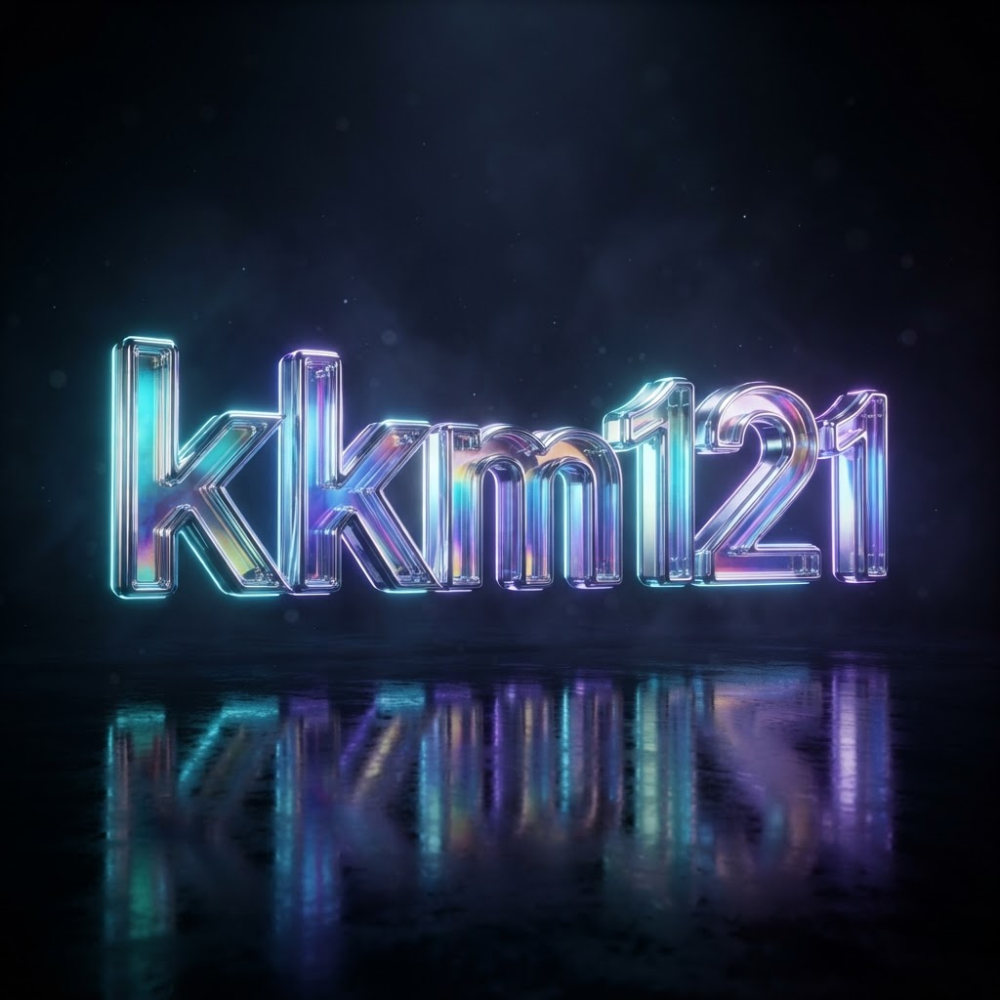
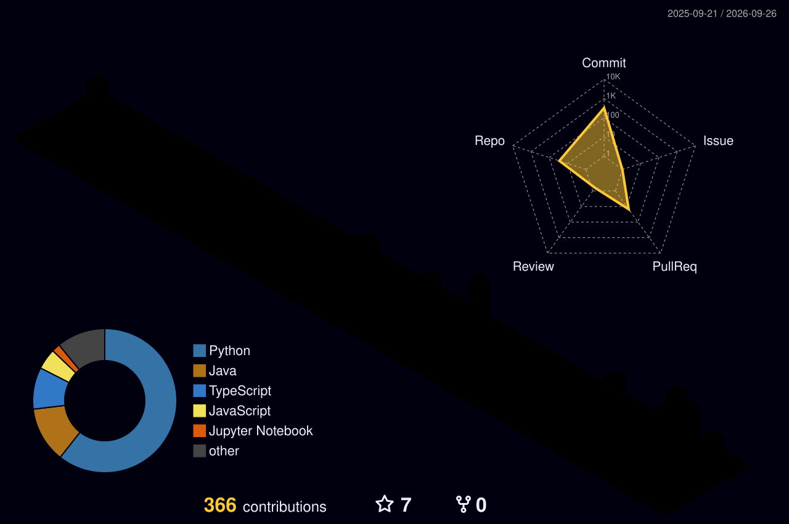

<!-- ═══════════════════════ ANIMATED WAVE HEADER ═══════════════════════ -->
<div align="center">
  
</div>

<!-- ═══════════════════════ 3D WORDMARK ═══════════════════════ -->
<div align="center">
  
</div>

<!-- ═══════════════════════ TYPING ANIMATION (always in motion) ═══════════════════════ -->
<div align="center">
  <a href="https://github.com/kkm121">
    
  </a>
</div>

<div align="center">
  
  <a href="https://www.linkedin.com/in/m-muthu-kumaran-expert">
    
  </a>
  <a href="https://github.com/kkm121?tab=followers">
    
  </a>
</div>

<br/>

<!-- ═══════════════════════ REALISTIC WORKSPACE ═══════════════════════ -->
<div align="center">
  
  <br/>
  <sub>⌨️ <i>Where the magic happens — late nights, coffee, and gradient descent.</i></sub>
</div>

<br/>

<!-- ═══════════════════════ SNOW: PAUSE / PLAY ═══════════════════════ -->
<details open>
  <summary><b>❄️ Let it snow &nbsp;·&nbsp; click here to pause / play the snowfall</b></summary>
  <br/>
  <div align="center">
    
  </div>
</details>

<br/>

<!-- ═══════════════════════ ABOUT ME ═══════════════════════ -->
## 🧬 Who am I?

```python
class MuthuKumaran:
    def __init__(self):
        self.name      = "M Muthu Kumaran"
        self.handle    = "kkm121"
        self.role      = "Computer Science Student"
        self.passion   = "Applying advanced computational techniques to real-world challenges"
        self.exploring = ["Artificial Intelligence", "Reinforcement Learning",
                          "Multi-Agent Systems", "Quantum-Inspired Computing"]
        self.open_source = "Actively exploring and contributing to projects like OpenVINO"

    def current_mission(self):
        return "Turning research ideas into systems that actually work 🚀"
```

- 🧠 I build **AI systems that see, reason, and act** — from RL agents that enhance vision pipelines to autonomous multi-agent research assistants
- ⚛️ Fascinated by **quantum-inspired algorithms** and what's beyond classical computing
- 🌱 Diving deep into **open source** — learning from and working with real-world codebases like OpenVINO
- 🎯 Philosophy: *ship things that measurably work, guard against regressions, and never stop exploring*

<br/>

<!-- ═══════════════════════ TECH STACK ═══════════════════════ -->
## 🛠️ Tech Stack & Arsenal

<div align="center">

### Languages & Core


### AI / ML & Vision


### Backend & Tooling


### Specialized Weapons 🗡️
<p>
  
  
  
</p>
<p>
  
  
  
</p>

</div>

<br/>

<!-- ═══════════════════════ 3D CONTRIBUTION CITY (auto-updates daily) ═══════════════════════ -->
## 🏙️ My Contributions — in 3D

<div align="center">
  
  <br/>
  <sub>🌃 <i>Every block is a real contribution — this skyline rebuilds itself every night as I code.</i></sub>
</div>

<br/>

<!-- ═══════════════════════ LIVE STATS (auto-update) ═══════════════════════ -->
## 📡 Live Telemetry

<div align="center">
  
  
</div>

<div align="center">
  
</div>

<div align="center">
  
</div>

<div align="center">
  
</div>

<br/>

<!-- ═══════════════════════ SNAKE (auto-updates daily) ═══════════════════════ -->
## 🐍 The Contribution Snake

<div align="center">
  <picture>
    <source media="(prefers-color-scheme: dark)" srcset="https://raw.githubusercontent.com/kkm121/kkm121/output/github-contribution-grid-snake-dark.svg"/>
    <source media="(prefers-color-scheme: light)" srcset="https://raw.githubusercontent.com/kkm121/kkm121/output/github-contribution-grid-snake.svg"/>
    
  </picture>
</div>

<br/>

<!-- ═══════════════════════ CONNECT ═══════════════════════ -->
## 🤝 Let's Build Something

<div align="center">
  <a href="https://www.linkedin.com/in/m-muthu-kumaran-expert">
    
  </a>
  <a href="https://github.com/kkm121">
    
  </a>
</div>

<br/>

<div align="center">
  
</div>
